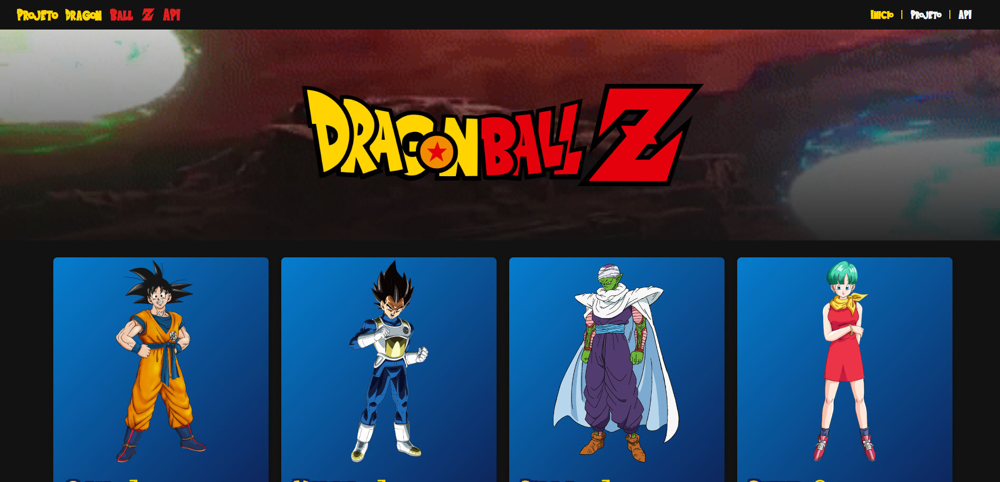
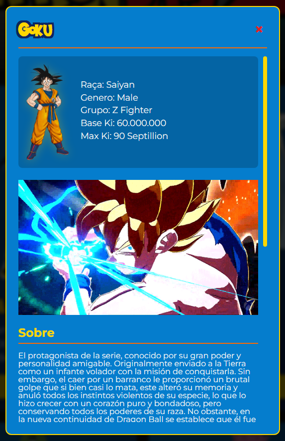
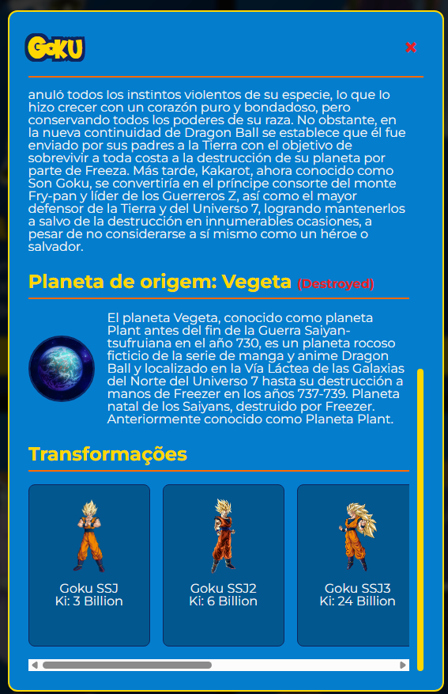

# 🐉 Dragon Ball Z API 

## 📖 Sobre o Projeto
Desenvolvido para a conclusão da disciplina de *Web Programming for Front-End*, esta aplicação é um catálogo interativo que consome a [Dragon Ball API](https://web.dragonball-api.com/). 

O projeto foi construído sem o uso de frameworks modernos. O requisito obrigatório foi utilizar apenas a tríade fundamental da web, garantindo que toda a geração de interface (cards, paginação e modais) fosse injetada dinamicamente via JavaScript. 

Mais do que uma entrega acadêmica para o curso de Análise e Desenvolvimento de Sistemas, este projeto foi uma oportunidade incrível de praticar conceitos de requisições assíncronas e manipulação de DOM, tudo isso enquanto me divertia programando ao lado dos heróis da minha infância.

## 📸 Demonstração da Interface
Abaixo estão algumas telas mostrando o layout e o funcionamento do projeto:

<div align="center">
  
  <br><br>
  
  <br><br>
  
</div>

## 🚀 Funcionalidades
- Consumo de API RESTful com `fetch` e `async/await`.
- Renderização 100% dinâmica dos cards de personagens através da manipulação do DOM.
- Paginação inteligente (botão de carregar mais com travas de requisição).
- Sistema de detalhes em Modal utilizando a tag nativa `<dialog>` do HTML5.
- Mudança dinâmica da cor de SVGs utilizando CSS Masks aplicadas via JavaScript.
- Design responsivo e temático com uso de CSS Variables (Custom Properties).

## 🛠️ Tecnologias Utilizadas
- **HTML5** (Semântico e estrutural)
- **CSS3** (Flexbox, CSS Masks, Variáveis e Efeitos de Hover)
- **JavaScript Vanilla** (ES6+, DOM API, Fetch API, Promises)

## Projeto ao vivo
- [Clique aqui para testar o projeto](https://dbz-api-two.vercel.app/).

## 💻 Como executar o projeto

1. Faça o clone deste repositório:
   ```bash
   git clone [https://github.com/SEU_USUARIO/NOME_DO_REPOSITORIO.git](https://github.com/SEU_USUARIO/NOME_DO_REPOSITORIO.git)
